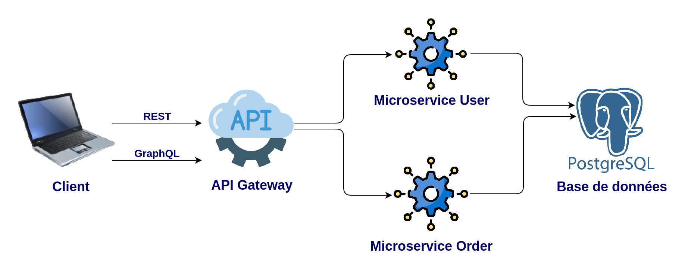

# Project MicroService

This project is a simple skeleton code for microservice architecture pattern using Node.js , PostgreSQL , Prisma , Rest , GraphQL.




# Technologies

* **gRPC** : Used for efficient communication between microservices.


* **GraphQL** : Implemented for flexible and efficient querying of data.


* **REST**: RESTful APIs are used for exposing the services to external clients.


# User MicroService

Contains API related to creating a new USER and API end point to get this USER

- Rest :


```http
POST /user
```

| Parameter   | Type     | Description                       |
| :-----------| :------- | :-------------------------------- |
| `name`      | `string` | **Required**.                     |
| `prenom`    | `string` | **Required**.                     |

- GraphQL :

```graphql
mutation Mutation($name: String!, $prenom: String!) {
  createUser(name: $name, prenom: $prenom) {
    id
    name
    prenom
  }
}

variable 
{
  "name": "test",
  "prenom": "test"
}

```

- Rest :


```http
GET /users
```

- GraphQL :


```graphql
query {
   users {
    id
    name
    prenom
  }
}
```


# Order MicroService

Contains API related to creating a new ORDER and API end point to get this ORDER

- Rest :


```http
POST /orders
```

| Parameter        | Type     | Description                       |
| :----------------| :------- | :-------------------------------- |
| `name`           | `string` | **Required**.                     |
| `description`    | `string` | **Required**.                     |


- GraphQL :


```graphql
mutation Mutation($name: String!, $description: String!) {
  createOrder(name: $name, description: $description) {
    id
    name
    description
  }
}

}

variable 
{
  "name": "test",
  "description": "test"
}
```


- Rest :


```http
GET /orders
```

- GraphQL :


```graphql
query {
   orders {
    id
    name
    description
  }
}
```


# Requirements

**Ensure you have the following software installed on your local machine** :

git

Node.js (version 18 or higher)

npm (version 6 or higher)

PostgreSQL

# Common setup

Clone the repo and install the dependencies.

git clone https://github.com/rimbergaoui/Project.git

`cd Project`

`npm install`

# Run

To start the ApiGateway server, run the following

`node apiGerway.js`

To start the User server, run the following

`cd userMicroservice`

`node userMicroservice.js`

To start the Order server, run the following

`cd orderMicroservice`

`node orderMicroservice.js`
